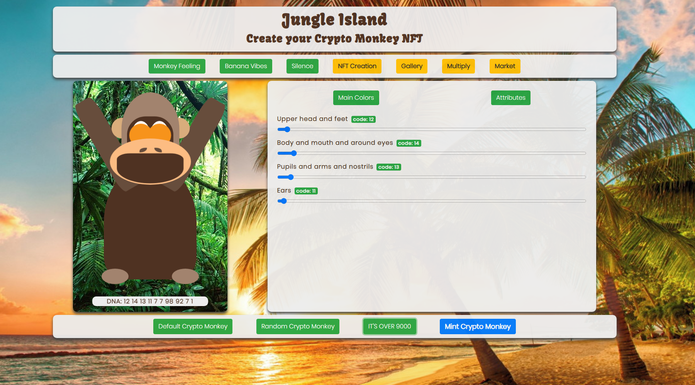

# CryptoMonkeys
CryptoMonkeys is an ERC721 token platform, where you can mint, breed, buy and sell your own CryptoMonkey NFTs.

## Table of Contents

- [Ethereum](#ethereum)
  - [Smart contract structure](#smart-contract-structure)
  - [Smart contract standards](#smart-contract-standards)
- [Setup](#setup)
  - [Installation](#installation)
  - [Deploy locally](#deploy-locally)  
- [Using the NFT platform](#using-the-nft-platform)
  - [Navigation bar](#navigation-bar)
  - [NFT Creation](#nft-creation)
  - [Gallery](#gallery)
  - [Multiply](#multiply)
  - [Market](#market)
- [CryptoMonkey NFT attributes](#cryptomonkey-nft-attributes)    
    - [DNA](#dna)
    - [Generation](#generation)
    - [Randomness](#randomness)  

## Ethereum

Contracts are written in Solidity.

- Unit tested using [Hardhat](https://hardhat.org/getting-started/#installation)
- [ERC721](http://erc721.org/) compatible
- [ERC721Enumerable](https://github.com/OpenZeppelin/openzeppelin-contracts/blob/master/contracts/token/ERC721/extensions/ERC721Enumerable.sol) compatible

### Smart contract structure

- **MonkeyContract.sol** is the main contract. It includes everything to mint, burn, track and transfer CryptoMonkey NFTs.

- **MonkeyMarketplace.sol** includes everything to create, fulfill and delete offers, so that users can buy and sell CryptoMonkey NFTs.

- **BananaToken.sol** is an ERC20 Token that users need to mint or breed their CryptoMonkey NFTs in the main contract. Also includes a faucet. 

### Smart contract standards

- **MonkeyContract.sol** imports and is compatible with:
  - [ERC721](http://erc721.org/) 
  - [ERC721Enumerable](https://github.com/OpenZeppelin/openzeppelin-contracts/blob/master/contracts/token/ERC721/extensions/ERC721Enumerable.sol) 
  - [Ownable](https://github.com/OpenZeppelin/openzeppelin-contracts/blob/master/contracts/access/Ownable.sol)
  - [SafeMath](https://github.com/OpenZeppelin/openzeppelin-contracts/blob/master/contracts/utils/math/SafeMath.sol)
  - [ReentrancyGuard](https://docs.openzeppelin.com/contracts/3.x/api/utils#ReentrancyGuard)
  - [Pausable](https://docs.openzeppelin.com/contracts/3.x/api/utils#Pausable)
  - Also imports the interfaces for [ERC20](https://eips.ethereum.org/EIPS/eip-20) and [MonkeyMarketplace](https://github.com/ctrl030/CryptoMonkeys/blob/main/contracts/MonkeyMarketplace.sol)

- **MonkeyMarketplace.sol** imports and is compatible with: 
  - [Ownable](https://github.com/OpenZeppelin/openzeppelin-contracts/blob/master/contracts/access/Ownable.sol)
  - [SafeMath](https://github.com/OpenZeppelin/openzeppelin-contracts/blob/master/contracts/utils/math/SafeMath.sol)
  - [ReentrancyGuard](https://docs.openzeppelin.com/contracts/3.x/api/utils#ReentrancyGuard)
  - [Pausable](https://docs.openzeppelin.com/contracts/3.x/api/utils#Pausable)
  - Also imports the interface for [MonkeyContract](https://github.com/ctrl030/CryptoMonkeys/blob/main/contracts/Monkeycontract.sol)

- **BananaToken.sol** imports and is compatible with: 
  - [Ownable](https://github.com/OpenZeppelin/openzeppelin-contracts/blob/master/contracts/access/Ownable.sol)
  - [ERC20](https://eips.ethereum.org/EIPS/eip-20)


## Setup

### Installation

You can follow these links to install the needed software:

- [Node.js](https://nodejs.org/en/)
- [Metamask](https://metamask.io/)
- [Truffle](https://www.trufflesuite.com/docs/truffle/quickstart)
- [Ganache](https://www.trufflesuite.com/docs/ganache/quickstart)

### Deploy locally 

- To run the client, you can run a local blockchain via [Ganache](https://www.trufflesuite.com/docs/ganache/quickstart) and deploy the smart contracts
- Copy the simulated private key from the first account in the list and import it into [Metamask](https://metamask.io/)
- Connect via Metamask to the locally deployed Ganache blockchain
- Run the client, for ex. directly via the [Live Server Plugin](https://marketplace.visualstudio.com/items?itemName=ritwickdey.LiveServer) for [VS Code](https://code.visualstudio.com/) or via [Python’s HTTP Server](https://www.tutorialspoint.com/python_network_programming/python_http_server.htm)
using ```python -m http.server```
- Upon loading, Metamask will ask to connect to the client. Choose the correct account that you just imported from Ganache. Confirm that it has about 100 simulated test Ether to use, the same amount shown for this account in Ganache.

## Using the NFT platform

### Navigation bar
  - Audio buttons: The three green buttons in the top left “Monkey Feeling”, “Banana Vibes” and “Silence” can be used to add atmosphere
  - Navigation buttons: The four yellow buttons in the top right “NFT Creation”, “Gallery”, “Multiply” and “Market” can be used to navigate the page
  
Everything below the navigation bar relates to the part of the page that the user is currently using, i.e. either the NFT Creation, Gallery, Multiply or Market area.

### NFT Creation

This is where the user starts. This section let’s you configure a CryptoMonkey NFT via the sliders, organized into the two subsections “Main Colors” and “Attributes”. Each change in the NFTs characteristics is saved into its “DNA string” that you can see underneath the CryptoMonkey to the left. Users can also use the “Default CryptoMonkey”, “Random CryptoMonkey” and “It’s over 9000” buttons to access some pre-defined ones. Once the user is happy with their creation, they can click the blue “Mint CryptoMonkey” button, to mint the NFT to the (in this case local) blockchain. Metamask will open and upon confirmation, the user now own’s this NFT on this blockchain, which is identified by a unique Token ID number. 

**Note:** The user will need the ERC20 BananaToken to pay for the NFT creation and allow the main smart contract to handle them. To get some of these, users can use the free faucet through the button “Get Bananas” in the top right and confirm via Metamask. Afterwards, in place of the "Get Bananas" button, a "Allow Bananas" button will appear. Use this to approve the main smart contract to handle the BananaToken. Now you can mint and breed.

### Gallery
To check out all their CryptoMonkey NFTs, the user can navigate to the gallery, where they are displayed.

### Multiply

Here a user can combine two CryptoMonkey NFTs that they own to create a third “child” CryptoMonkey NFT. The new NFT’s DNA will consist of randomly combined traits from their “parents”, as well as one randomly generated trait, that is new and different. Their generation will depend on their parents’ generations. (To find out more about this mechanism you can check the [_calcGeneration function](https://github.com/ctrl030/CryptoMonkeys-V2/blob/main/contracts/MonkeyContract.sol))

**Note:** The user will need the ERC20 BananaToken and allow the main smart contract to handle them, so that they can pay for the breeding of NFTs. Check the [NFT Creation](#nft-creation) section to see how to do this.

### Market

- Buy Monkeys

Here a user will find all open sell offers (excluding their own, see “My Monkeys on Sale”) for CryptoMonkeys. Buying works by entering the Token ID and listed price in ETH and then confirming the purchase transaction via Metamask.

- Sell Monkeys

To sell CryptoMonkey NFTs via the market, a user will first have to give the MonkeyMarketplace smart contract operator status, so that the contract can handle sell offers and transfers on their behalf. After using the respective button “Allow Market to handle NFTs” and confirming via Metamask, the user can now create offers and sell his NFTs in the marketplace

 - My Monkeys on Sale

This will display all the user’s CryptoMonkey NFTs that are on sale at the moment. Offers can be canceled/removed by using the menu below the navigation bar and confirming via Metamask.

## CryptoMonkey NFT attributes

### DNA

Every CryptoMonkey NFT includes a 16-digit DNA-string, which encodes the NFTs different traits: different coloring, animations and one secret attribute.

### Generation

Every CryptoMonkey NFT has a generation, referring to how and when it was created. There is a hard limit of 12 Monkeys that are part of the generation 0, which at this point can only be created by the platform / owner. Demo Monkeys have generation 99, bred monkeys' generations depend on their parents' generation.

### Randomness

Randomness is simulated / pseudo-randomness at this point, mostly a placeholder for randomness-getting-functions, for ex. the Chainlink VRF.
